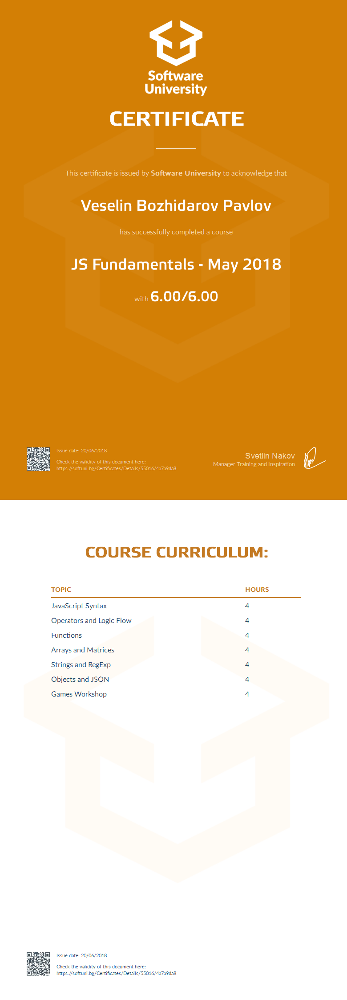

<a href="https://softuni.bg/trainings/courses" rel="Courses">  ![SoftUni logo][logo] <a/>

[logo]: http://innovationstarterbox.bg/wp-content/uploads/2016/05/Softuni_logo_trasparent.png "Logo Title Text 2"

---
The JavaScript Fundamentals course builds basic programming skills with JavaScript. Studying JavaScript constructs for building logic logic, data types, operators, expressions, conditional constructs, cycles, and function handling. Attention is drawn to work with arrays, strings and regular expressions, use of objects, associative arrays and sets. The course is based on state-of-the-art standards and JS technologies (ES2017 is being studied).

# Course: JavaScript Fundamentals

## Topics:
01. JavaScript Syntax
02. Operators and Logic Flow
03. Functions
04. Arrays and Matrices
05. Strings and RegExp
06. Objects and JSON
07. Canvas 2D

## Status:
Completed.

## Certificate:

 
